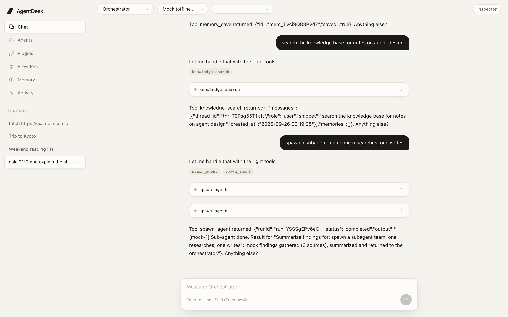
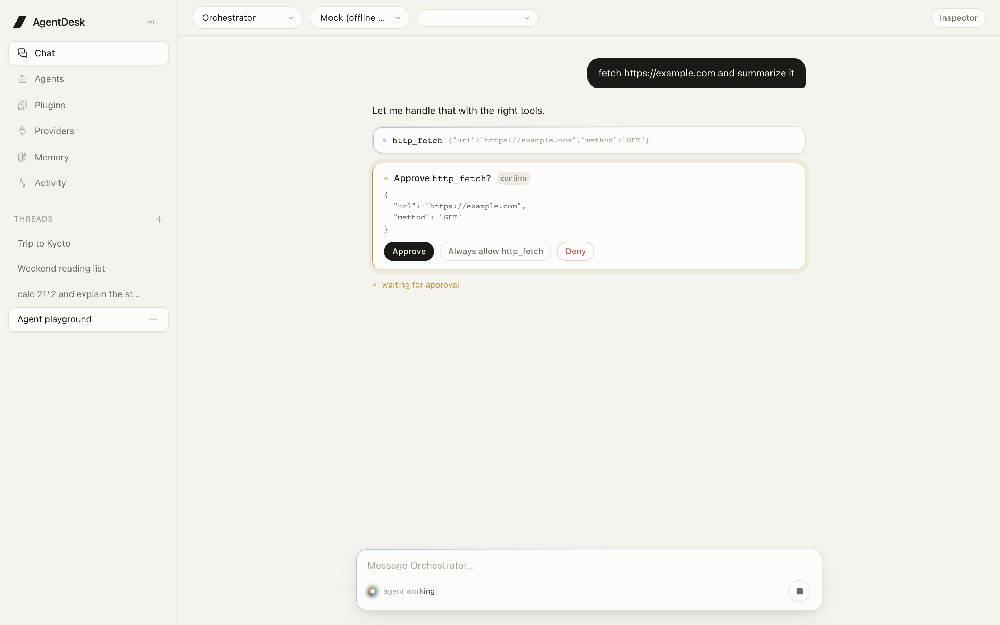
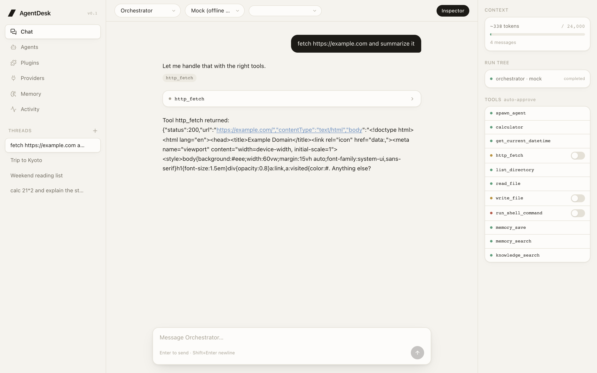
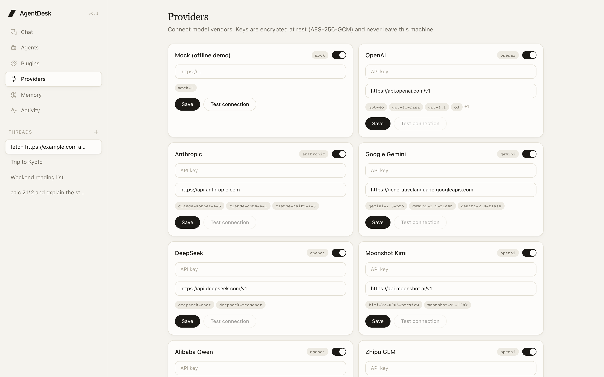
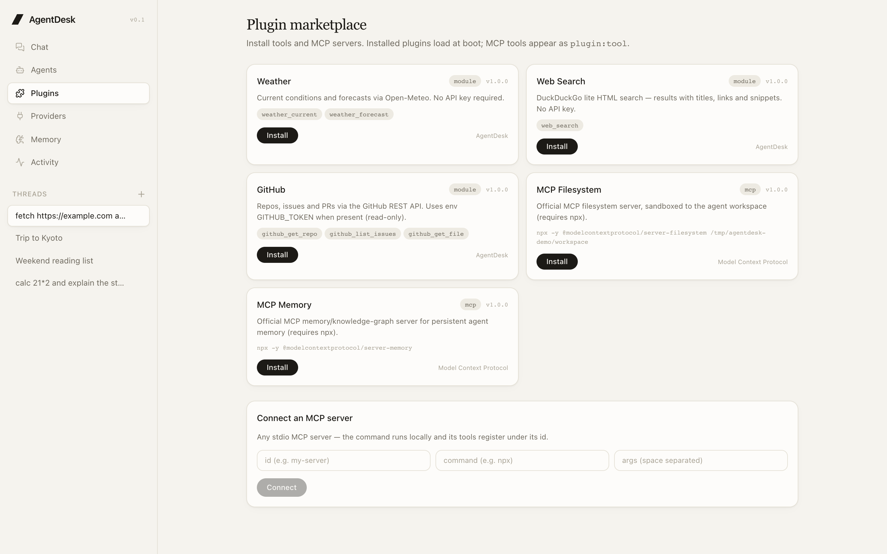
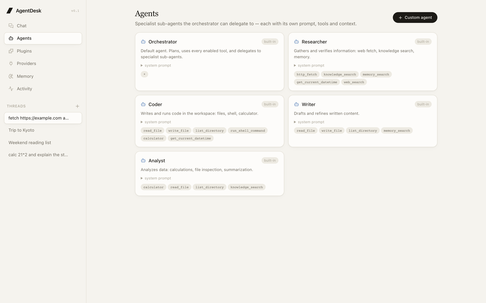

<div align="center">

# AgentDesk

**本地优先的 Agent 工作台 —— 也是一份可以完整读一遍的「Agent 是怎么跑起来的」开源示例。**

多供应商模型网关 · 带人工审批闸门的工具/插件系统 · 独立上下文子 Agent · 持久化线程 —— 全部装在一个轻依赖的应用里。

[English](README.md) · [简体中文](README.zh-CN.md)




</div>

## 为什么是这个仓库

大多数 Agent 框架把最有意思的部分藏在抽象后面。AgentDesk 用一个
**零运行时依赖的 Node 后端**（约 2k 行）实现了完整的 Agent 循环 ——
模型驱动、工具注册表、审批闸门、子 Agent 隔离上下文、上下文压缩、SSE 事件回放 ——
小到一晚上能读完，大到可以真的拿来用。

想搞清楚一个编码型 Agent 的底层原理，直接读
[`server/agentdesk/agents/runtime.js`](server/agentdesk/agents/runtime.js) ——
整个运行循环就是一个函数。

## 功能亮点

- **多供应商模型网关** —— 3 种协议驱动（OpenAI 兼容 / Anthropic / Gemini）覆盖 17 家供应商，
  外加离线 **mock** 供应商，零 API key 也能完整跑通：OpenAI、Anthropic、Google、DeepSeek、
  Moonshot (Kimi)、Qwen、Zhipu (GLM)、MiniMax、Doubao、Mistral、Groq、xAI、
  OpenRouter、Ollama、LM Studio，以及自定义 OpenAI 兼容端点。
- **人工审批闸门** —— `http_fetch`、`write_file`、`run_shell_command` 和所有 MCP 工具
  会暂停运行等待人工决定（批准一次 / 总是允许 / 拒绝）；拒绝结果会反馈给模型。
- **子 Agent** —— `spawn_agent` 把独立任务委派给专家 Agent（researcher、coder、writer、
  analyst，或你自定义的），各自持有隔离上下文；UI 内联渲染子运行树，深度 ≤ 3。
- **上下文管理** —— 按运行的 token 预算计量、旧轮次自动压缩为滚动摘要，
  Inspector 面板可以看到模型实际看到的上下文。
- **插件市场** —— 内置模块插件（天气、网页搜索、GitHub 只读）+ **MCP stdio 服务器**：
  接入任意 MCP server，其工具以 `plugin:tool` 形式注册，全部走审批闸门。
  把 `.mjs` 模块丢进 `~/.agentdesk/plugins/` 即可自定义。
- **持久化线程** —— SQLite（WAL）存储；每次运行都是可回放的事件流，经 SSE 实时推送，
  刷新甚至崩溃都不丢数据。
- **桌面壳** —— `desktop/` 里的 Electron 封装，内嵌服务端生命周期管理。

## 截图

| 审批闸门 | 运行 Inspector |
|---|---|
|  |  |

| 供应商 | 插件市场 | Agents |
|---|---|---|
|  |  |  |

## 快速开始

需要 **Node ≥ 22**（用了 `node:sqlite`）。

```bash
npm install
npm --prefix web install
npm run build        # 构建 web/dist
npm run dev          # http://127.0.0.1:8787
```

内置 **mock** 供应商开箱即用、完全离线、无需任何 key。
试试这些提示词，可以触达每个子系统：

| 提示词 | 触达的功能 |
|---|---|
| `calc 21*2` | `calculator` 工具 |
| `fetch example.com` | `http_fetch` + **审批闸门** |
| `write a file` | `write_file`（工作区沙箱 + 审批） |
| `run a shell command` | `run_shell_command`（高危审批级别） |
| `remember I like oolong` | `memory_save` —— 共享 Agent 记忆 |
| `search the knowledge base` | `knowledge_search` —— 历史消息检索 |
| `spawn a subagent team` | 两个委派的子运行（researcher + writer） |

前端开发（HMR）：`npm --prefix web run dev`（Vite :5173，`/api` 代理到 :8787）。

数据目录 `~/.agentdesk/`（`agentdesk.db`、`plugins/`、`workspace/`、`.master-key`）。
用 `AGENTDESK_DATA_DIR` 覆盖数据目录，`AGENTDESK_PORT` 覆盖端口。

## Agent 循环怎么跑

```
user message
   │
   ▼
构建上下文 ──► chat.completions 流式 ──► 文本？ → 持久化 → 回复
   │  （历史消息、摘要、                │
   │    记忆、工具 schema）             ▼
   │                            tool_call → 需要审批？
   │                              │       是 → 暂停运行，等待人工决定
   │                              ▼
   └──────────── 工具结果 ── 在沙箱中执行
                              │
                   spawn_agent → 子运行（隔离上下文，深度 ≤ 3）
```

每一步都会发出持久化事件（`run_started`、`assistant_delta`、`tool_call`、
`approval_requested`、`subagent_started`、`run_completed` …）——
`GET /api/runs/:id/events` 可以回放任意一次运行，无论是否已结束。

核心代码推荐阅读顺序：`agents/runtime.js`（主循环）→
`agents/context.js`（上下文组装与压缩）→ `tools/`（注册表、内置工具、沙箱）→
`providers/`（三个协议驱动）。

## 架构

```
web/            React 19 + Vite + Tailwind v4 —— 聊天、运行 Inspector、插件、设置
server/
  index.js      node:http 服务 —— 安全响应头、API 路由、静态 SPA
  agentdesk/
    api.js      REST + SSE 路由、启动装配
    db.js       node:sqlite（WAL）：threads、runs、messages、events、approvals、plugins、memories
    events.js   事件总线 —— 持久化 + 扇出给 SSE 订阅者
    crypto.js   AES-256-GCM 密钥保管（master key 文件）
    providers/  驱动契约 + openai / anthropic / gemini / mock，供应商目录
    tools/      注册表 + 内置工具（calc、http_fetch、文件、shell、memory、knowledge）
    agents/     角色、上下文构建/压缩、运行时（循环、审批、子 Agent）
    plugins.js  市场目录、模块 + MCP 插件激活
    mcp.js      stdio JSON-RPC MCP 客户端
plugins/        内置模块插件（weather、web-search、github）
desktop/        Electron 壳（可选）
tests/          node:test —— providers、context、runtime/approvals、安全
```

**服务端零运行时依赖** —— 只要 Node ≥22（`node:http`、`node:sqlite`、`node:crypto`）。
Vite/React/Tailwind 只存在于 `web/` 里用于 UI 构建。

## API 速览

```
GET  /api/health
GET/PUT/POST/DELETE  /api/providers[...]      供应商配置 + 连通性测试
GET/POST/DELETE      /api/agents[...]         内置 + 自定义 Agent
GET/POST/DELETE      /api/threads[...]        线程 + 消息 + 运行
POST /api/threads/:id/runs                    启动一次运行 → { runId }
GET  /api/runs/:id/events                     SSE 事件流（回放 + 实时）
POST /api/runs/:id/cancel
GET  /api/runs/:id/context                    token 预算 / 压缩统计
GET  /api/approvals · POST /api/approvals/:id 待审批工具
PUT  /api/settings/auto-approve               按工具「总是允许」
GET/POST/DELETE      /api/plugins[...]        市场、安装、MCP 连接
GET/DELETE           /api/memory[...]         共享 Agent 记忆
GET  /api/activity                            最近事件流
```

## 测试

```bash
npm test     # node:test —— provider 解析、上下文压缩、
             # 审批闸门、子 Agent、SSRF/沙箱/加密
```

## 安全

见 [SECURITY.md](SECURITY.md) —— 供应商密钥 AES-256-GCM 加密存储、SSRF 防护、
按工具审批闸门、工作区沙箱、CSP/安全响应头，以及模块插件的威胁模型。

## 贡献

这是一个面向学习的代码库 —— 小、零依赖、就是为了让人读的。欢迎提 Issue 和 PR。

## License

Apache-2.0 —— 见 [LICENSE](LICENSE)。
